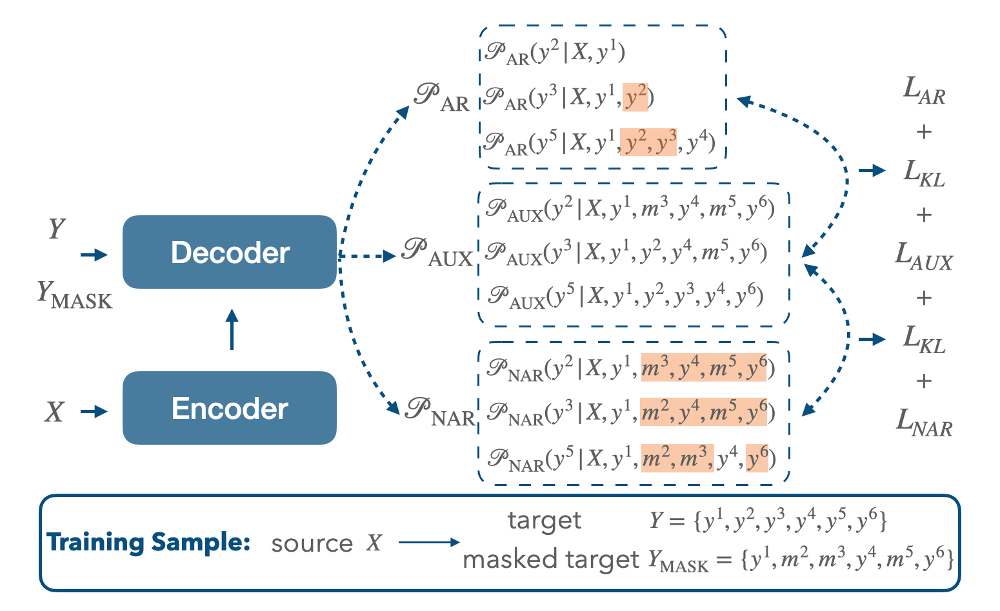
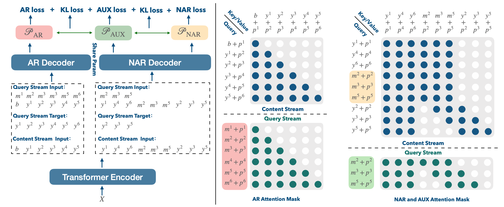

# <span style="color:#102b6a;">JANUS</span>: <span style="color:#102b6a;">J</span>oint <span style="color:#102b6a;">A</span>utoregressive and <span style="color:#102b6a;">N</span>on-autoregressive training using a<span style="color:#102b6a;">U</span>xiliary los<span style="color:#102b6a;">S</span>

## Overview
This repository contains the code for our EMNLP2022 paper [JANUS: Joint Autoregressive and Non-autoregressive Training with Auxiliary Loss for Sequence Generation]().

JANUS is a new training strategy to enhance the model performance in both AR and NAR manner simultaneously and effectively alleviate the problem of distribution discrepancy.

The problem of distribution discrepancy:
<!-- {:height="50%" width="50%"} -->
<div  align="center">  
 
</div>

JANUS:
<!--  -->
<div  align="center">  
 
</div>

## Getting Started

You can init environment via the toolkit of conda and pip, and choose a suitable [Pytorch](https://pytorch.org/get-started/locally/) version according to your platform:

```bash
# For example:
conda create -n janus python==3.8
pip3 install torch torchvision torchaudio --extra-index-url https://download.pytorch.org/whl/cu116

```
Install this project:
```bash
pip install --editable .
```

Download and process the data:

+ IWSLT14 De-En: We use the fairseq scripts [prepare-iwslt14.sh](https://github.com/facebookresearch/fairseq/blob/main/examples/translation/prepare-iwslt14.sh) to download data and preprocess the dataset following the [instructions](https://github.com/facebookresearch/fairseq/tree/main/examples/translation).
+ WMT16: We use the [processed data](https://github.com/facebookresearch/DisCo/issues/5) thanks to the DisCo authors and project.

+ GLGE: We use the [GLGE benchmark](https://github.com/microsoft/glge) for general NLG tasks.


Model Training with JANUS:
```bash
bash janus/scripts/iwslt/run_janus.sh
```
Model Inference with JANUS:
```bash
bash janus/scripts/iwslt/run_janus_nar_inf.sh
bash janus/scripts/iwslt/run_janus_ar_inf.sh
# results:
+---------+-------------+-------------+
| IWSLT14 | De->En (AR) | De->En (NAR)|
+---------+-------------+-------------+
| -       |    37.24    |    34.21    |
+---------+-------------+-------------+
```
